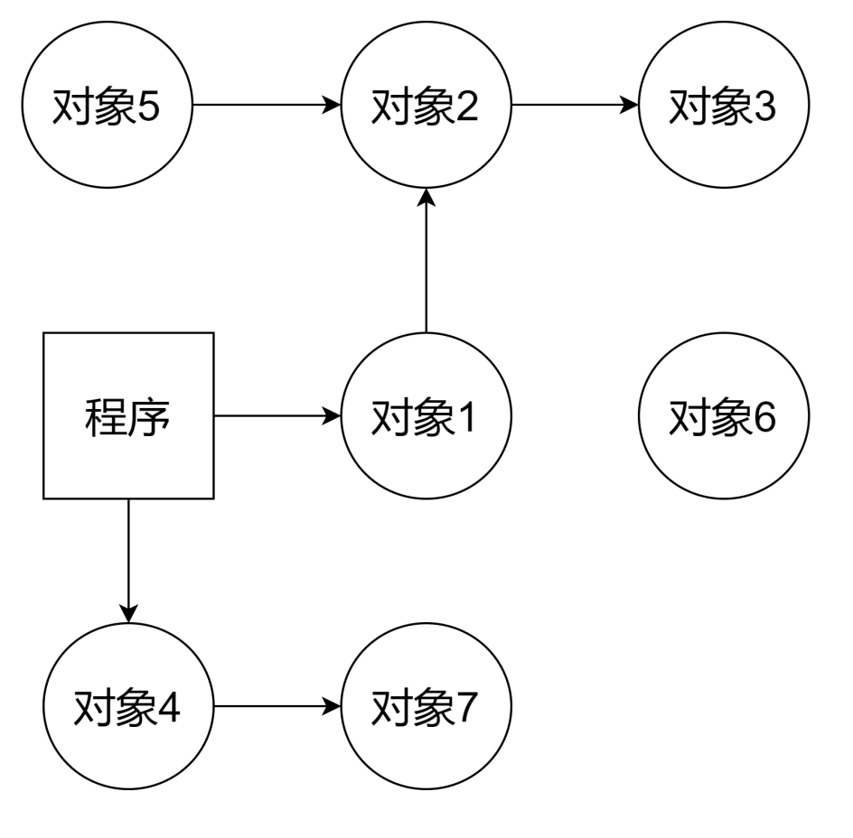

# Go语言垃圾回收机制详解

> from 刘丹冰《深入理解Go语言》

## Go V1.3标记-清楚法

1. 过程：
   1. 暂停业务流程，对可达不可达对象进行分类，做上标记
      
      如图：
      
      
      
      其中对象1、2、3和对象4、7均为可达，会打上标记
   2. 标记完之后，清楚未标记的对象
      
      操作简单，但是在执行Mark-Sweep算法时，需要程序暂停（Stop The World）
   3. 停止暂停，让程序继续运行，重复整个过程
2. 缺陷：
   - STW会让程序暂停，程序会出现卡顿
   
   - 标记需要扫描整个Heap
   
   - 清除数据会产生Heap碎片

3- 优化：将STW提前一步，STW仅包含标记

## Go V1.5三色标记法

Go语言中的垃圾回收主要应用三色标记法，GC过程和其他Goroutine可并发运行