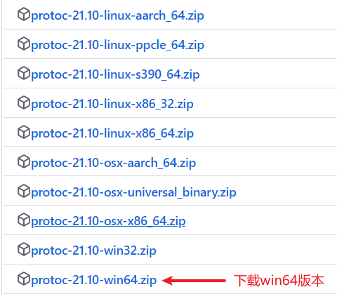

### 电脑环境
##### protoc安装:
- 安装地址: https://github.com/protocolbuffers/protobuf/releases
- 
- 解压文件，将/bin目录添加到环境变量中
- 验证安装结果：protoc --version

##### protoc-gen-go/protoc-gen-go-grpc安装：
- go install google.golang.org/protobuf/cmd/protoc-gen-go@latest
- go install google.golang.org/grpc/cmd/protoc-gen-go-grpc@latest

##### goctl安装：
- go install github.com/zeromicro/go-zero/tools/goctl@latest

##### etcd安装
- 安装地址：https://github.com/etcd-io/etcd/releases
- 下载相应的压缩包，解压，将目录添加到环境变量中
- 验证安装结果：etcd --version